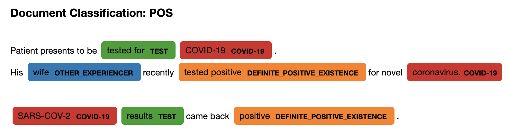
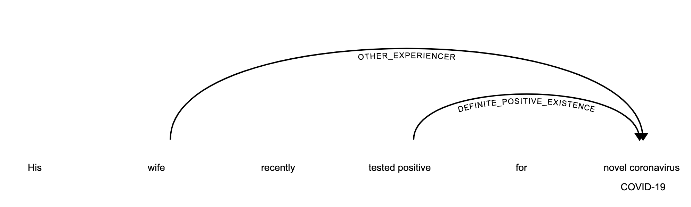

# VA_COVID-19_NLP_BSV
An NLP pipeline for COVID-19 surveillance used in the Department of Veterans Affairs Biosurveillance.
This system is described in [A Natural Language Processing System for National COVID-19 Surveillance in the US Department of Veterans Affairs](https://www.aclweb.org/anthology/2020.nlpcovid19-acl.10/)
by Chapman et al as part of the [ACL COVID-19 Emergency Workshop](https://www.nlpcovid19workshop.org/).

Our system was deployed as part of the VA response to the COVID-19 pandemic and has helped to identify a large number
of COVID-19 cases in the national VA healthcare system.

## Disclaimer
This repository its not meant to be a complete, finalized system for detection of COVID-19 in clinical text.
It was developed in the US Department of Veterans Affairs for a specific operational goal. However, performance will vary 
based on your data and use case. This is also not the exact system described in the paper above - it has been modified and 
simplified to be generalizable rather than being extremely specific to VA data.
 
You will likely need to customize your pipeline based on your data and needs. But hopefully we've made that easy to do! 
The tutorials in [./notebooks](./notebooks) show how each component works, how you can add new rules, and how to remove/add
components to the pipeline.

# Overview
This repository implements a version of the system described in [A Natural Language Processing System for National COVID-19 Surveillance in the US Department of Veterans Affairs](https://openreview.net/forum?id=ZQ_HvBxcdCv).
This was presented at the ACL 2020 Emergency COVID-19 Workshop. The [recorded presentation](https://youtu.be/alBnBPtFEAw) is available on YouTube.

The NLP system is designed as a [spaCy](https://spacy.io/) processing pipeline. Most components are implemented as part of the
[medSpaCy](https://github.com/medspacy/medspacy) package. 


The pipeline consists of the following main pieces:
1. Custom components imported from medSpaCy
2. A document classifier component which assigns the attribute `doc._.cov_classification` indicating whether a document 
**"POS"**, **"UNK"**, or **"NEG"** for COVID-19
3. A knowledge base containing rules which are added to the components and control which entities are extracted and what
attributes are assigned

# Usage
A detailed tutorial and explanation is provided in [./notebooks](./notebooks). These are also available as Google Colab notebooks: 
- [00-quickstart.ipynb](https://colab.research.google.com/drive/1f1qvdxr8rzLII4kEKrVF0W2Fqe2emLy9?usp=sharing)
- [01-target-matching.ipynb](https://colab.research.google.com/drive/1DCZJNJwD7VWiyCOE2-ORq_k1J8ERNGrV?usp=sharing)
- [02-attribute-assertion.ipynb](https://colab.research.google.com/drive/1P7qUnB-k7B_JzcS1ZpwF_eVZjFnkcF52?usp=sharing)
- [03-document-classification.ipynb](https://colab.research.google.com/drive/1fzgMtbd58-A9F7eaHh_2mN4aYBCOPgTY?usp=sharing)
- [04-fixing-errors](https://colab.research.google.com/drive/1gRqZlWBfTLbotKvP71--e2NvZv8ydiPu?usp=sharing)

## Installation
You can install `cov_bsv` using pip:

```bash
$ pip install cov-bsv
```

Or by cloning this repository and installing using `setup.py`:
```bash
$ python setup.py install
```

Once you've installed all the dependencies, you'll need to install the spaCy language model **en_core_web_sm**:
```bash
$ python -m spacy download en_core_web_sm
```

**cov_bsv requires Python>=3.6**

## Quick Start
Below is a simple example which takes a clinical text, loads a pipeline with the knowledge base, and processes the text.
We can then inspect the document classification and linguistic patterns extracted from the text using visualization 
functions from `cov_bsv` and `medspacy`.
```python
import cov_bsv

nlp = cov_bsv.load(model="default", load_rules=True)
text = """
Patient presents to rule out COVID-19. 
His wife recently tested positive for novel coronavirus.​

COVID-19 results pending.​
"""

doc = nlp(text)

cov_bsv.visualize_doc(doc)
```


```python
from medspacy.visualization import visualize_dep
doc = nlp("His wife recently tested positive for novel coronavirus.​")
visualize_dep(doc)
```


# Contact Information
If you have any questions or comments, or if you have applied NLP to help combat the COVID-19 pandemic,
we'd love to hear from you! Feel free to reach out using the contact information below.
- **Primary Developer:** Alec Chapman
- **Email Address:** alec.chapman@hsc.utah.edu

# Cite This Wrok
You can cite this work using the following BibTex citation:
```@inproceedings{chapman-etal-2020-natural,
    title = "A Natural Language Processing System for National {COVID-19} Surveillance in the {US Department of Veterans Affairs}",
    author = "Chapman, Alec  and
      Peterson, Kelly  and
      Turano, Augie  and
      Box, Tam{\'a}ra  and
      Wallace, Katherine  and
      Jones, Makoto",
    booktitle = "Proceedings of the 1st Workshop on {NLP} for {COVID-19} at {ACL} 2020",
    month = jul,
    year = "2020",
    address = "Online",
    publisher = "Association for Computational Linguistics",
    url = "https://www.aclweb.org/anthology/2020.nlpcovid19-acl.10",
    abstract = "Timely and accurate accounting of positive cases has been an important part of the response to the COVID-19 pandemic. While most positive cases within Veterans Affairs (VA) are identified through structured laboratory results, some patients are tested or diagnosed outside VA so their clinical status is documented only in free-text narratives. We developed a Natural Language Processing pipeline for identifying positively diagnosed COVID19 patients and deployed this system to accelerate chart review. As part of the VA national response to COVID-19, this process identified 6,360 positive cases which did not have corresponding laboratory data. These cases accounted for 36.1{\%} of total confirmed positive cases in VA to date. With available data, performance of the system is estimated as 82.4{\%} precision and 94.2{\%} recall. A public-facing implementation is released as open source and available to the community.",
}```